# Meadows Architecture

> [!NOTE]
> **Last updated:** 2026-03-17
>
> **Scope:** current implementation in this repository (`main` workspace state), including Daily Vibe Pulse visual analytics, comments/replies, notifications, profile search, and responsive navbar UX.

## 1. Architecture Goals

Meadows is designed as a fast, vibe-centric social network with these architectural priorities:

1. Low-friction interaction loops: post -> react -> comment -> reply -> return.
2. Minimal backend surface area: direct Supabase access from frontend (client + SSR contexts) rather than custom API routes.
3. Strong perceived performance: optimistic UI updates, React Query caching, progressive/infinite pagination, and lightweight payloads.
4. Product identity consistency: "vibes" are first-class entities across posts, comments, and daily pulse analytics.
5. Operational simplicity: Next.js Pages Router + Supabase + GitHub Actions CI/CD.

---

## 2. System Context

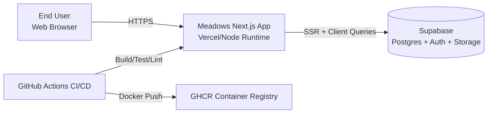

### Context Notes

- The app is a monorepo-like structure with the active web app under `web/`.
- The runtime has two Supabase access modes:
  - Browser client (`createBrowserClient`) for interactive pages.
  - SSR server client (`createServerClient`) for `getServerSideProps` auth gating + initial data checks.
- Storage buckets used by the app:
  - `avatars` (profile pictures)
  - `images` (post and comment media)

---

## 3. Runtime Containers and Boundaries

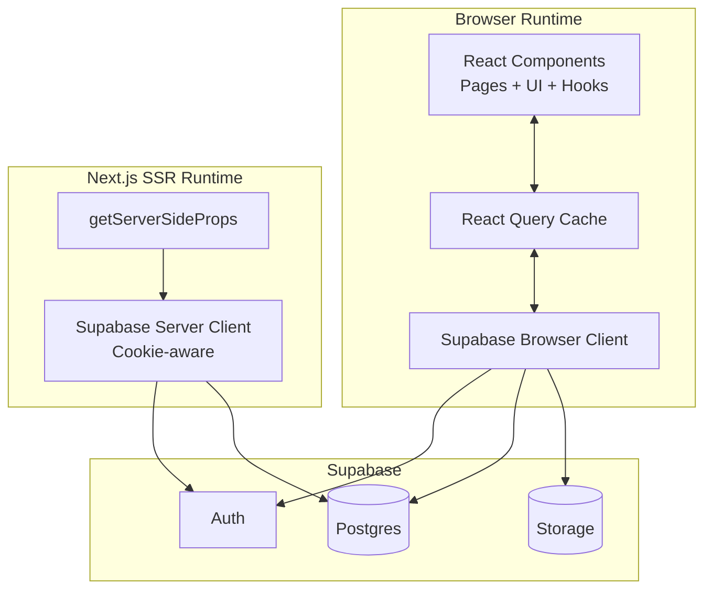

### Key Boundary Decisions

1. No custom backend API layer currently exists.
2. Query and mutation logic resides in `web/utils/supabase/queries/*.ts`.
3. Zod schemas in `web/utils/supabase/models/*.ts` enforce runtime payload shape validation.

---

## 4. Codebase Structure (Architecture-Oriented)

```text
/
├─ migrations/                          # SQL migration scripts (including feature pack)
├─ database/                            # SQL table/function definitions by feature
├─ web/
│  ├─ pages/                            # Next.js routes (Pages Router)
│  │  ├─ index.tsx                      # Marketing/landing
│  │  ├─ login.tsx, signup.tsx          # Auth entry screens
│  │  ├─ home.tsx                       # Main feed/composer
│  │  ├─ pulse.tsx                      # Daily Vibe Pulse dashboard
│  │  ├─ post/[id].tsx                  # Post details + comments thread
│  │  └─ profile/[id].tsx               # Public profile + posts
│  ├─ components/
│  │  ├─ header.tsx                     # Responsive global nav, notifications, profile search
│  │  ├─ post.tsx                       # Feed post card
│  │  ├─ post-comments.tsx              # Comments, replies, mentions, comment vibes
│  │  ├─ daily-vibe-pulse.tsx           # Pulse dashboard modules + custom vibe charts
│  │  └─ ui/*                           # Shared UI primitives
│  ├─ utils/
│  │  ├─ vibe.ts                        # Vibe constants, date helpers
│  │  └─ supabase/
│  │     ├─ clients/                    # Browser + SSR Supabase clients
│  │     ├─ models/                     # Zod schemas (post/comment/etc.)
│  │     └─ queries/                    # Data access/query logic
│  └─ styles/globals.css                # Design tokens + utility layers
└─ .github/workflows/ci.yml             # CI/CD pipeline
```

---

## 5. Route and Page Architecture

```mermaid
flowchart TD
  A[/] --> B[/login]
  A --> C[/signup]
  A --> D[/home]
  D --> E[/post/:id]
  D --> F[/profile/:id]
  D --> G[/pulse]
  E --> F
  E --> D
  F --> E
  F --> D
```

### SSR-Protected Routes

Protected pages run `getServerSideProps` with server Supabase client and redirect unauthenticated users:

- `/home`
- `/post/[id]`
- `/profile/[id]`
- `/pulse`

### Global App Shell

From `web/pages/_app.tsx`:

- `QueryClientProvider` wraps all pages.
- `ThemeProvider` manages light/dark/system themes.
- `Header` + `Footer` render on all non-landing routes.
- Vercel `Analytics` is mounted globally.

### Header Responsive Layout

The global navbar (`components/header.tsx`) now uses an explicit mobile-first structure:

1. Top row: compact brand + action cluster.
2. Second row: full-width profile search input.
3. Medium+ breakpoints: search shifts to center column layout.

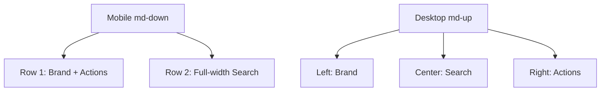

---

## 6. Authentication and Session Flow

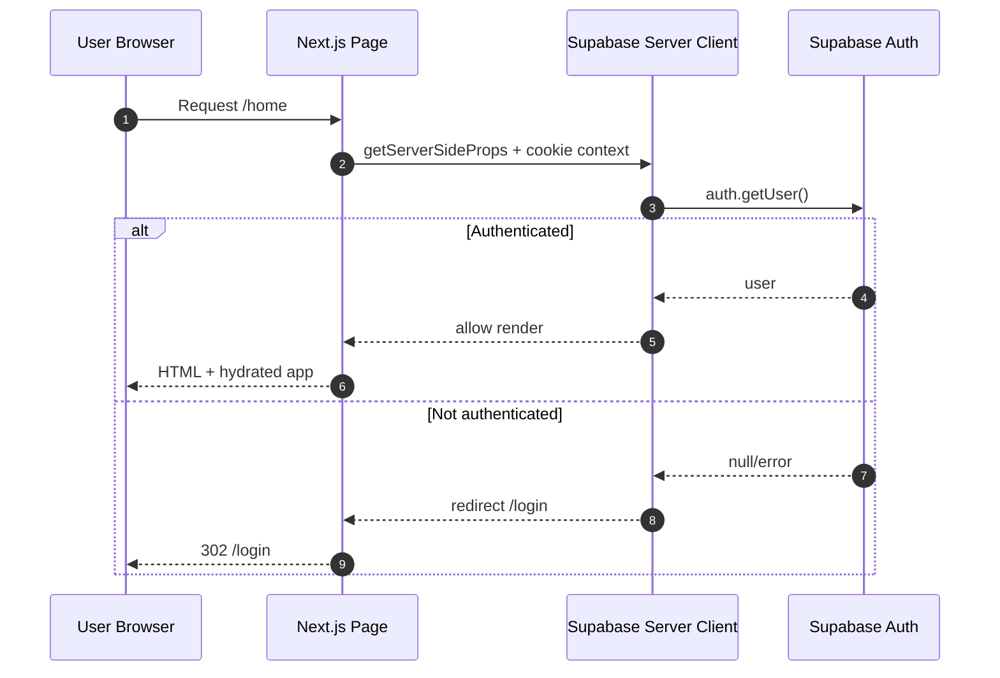

---

## 7. Data Access Layer

### Query Modules

| Module | Primary Responsibility |
|---|---|
| `queries/post.ts` | Feed retrieval, post retrieval, likes, post vibes, poll vote, post creation/media/poll persistence |
| `queries/comment.ts` | Comment CRUD, reply handling, mention suggestions, comment vibes, comment reports, notifications |
| `queries/profile.ts` | Profile retrieval, follow graph, profile posts, avatar updates, profile search |
| `queries/vibe-pulse.ts` | Daily status set/get, pulse aggregation, weekly recap aggregation |

### Internal Layering

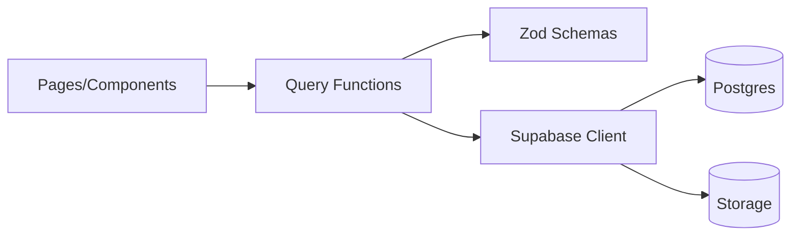

### Design Characteristics

1. Thin query functions with explicit inputs/outputs.
2. Zod parse at boundaries to harden runtime assumptions.
3. Cache invalidation centralized around domain events (post/comment/vibe mutations).

---

## 8. Domain Data Model

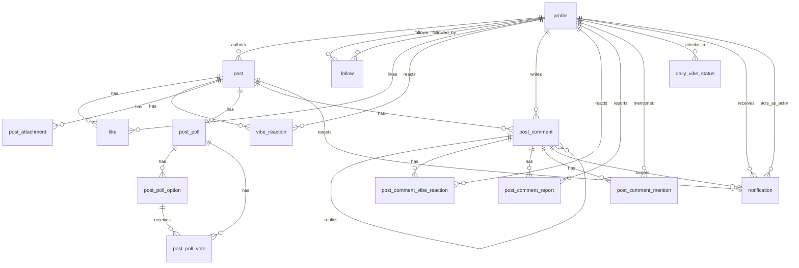

### Core Tables

- Social graph/content: `profile`, `post`, `follow`, `like`, `vibe_reaction`
- Media/polls: `post_attachment`, `post_poll`, `post_poll_option`, `post_poll_vote`
- Conversations: `post_comment`, `post_comment_vibe_reaction`, `post_comment_report`, `post_comment_mention`
- Vibe intelligence: `daily_vibe_status`
- Engagement signaling: `notification`

---

## 9. Data Integrity and Trigger Logic

### Comment Integrity + Guardrails

From `post_comment_feature.sql` / `20260316_add_daily_vibe_and_comments.sql`:

1. One-level reply depth enforcement.
2. Reply must belong to same post as parent comment.
3. Rate-limit: max 6 comment inserts per 30 seconds per author.
4. `post.comment_count` maintained by triggers.
5. `post_comment.reply_count` maintained by triggers.
6. `post_comment.vibe_count` maintained by triggers.
7. `engagement_score` computed as `vibe_count + (reply_count * 2)`.

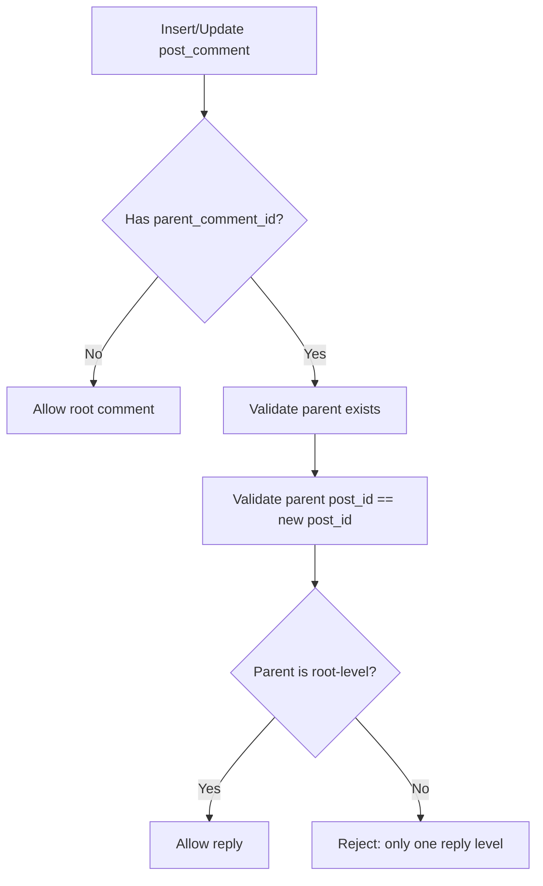

---

## 10. Feature Flow: Feed + Post Creation

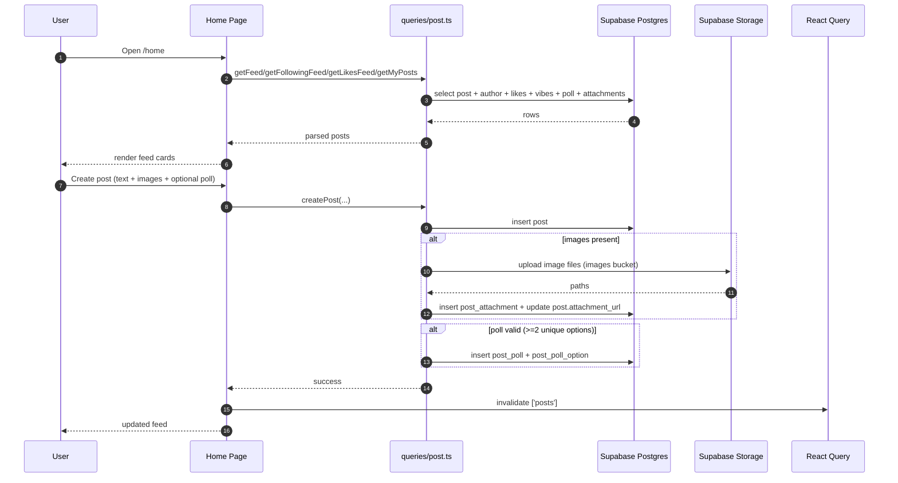

---

## 11. Feature Flow: Comments, Replies, Mentions, Notifications

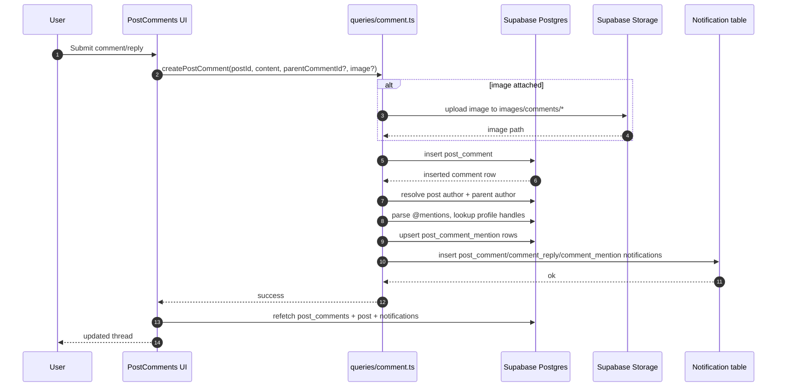

### Threading Behavior

- Database: strictly `post -> comment -> reply` (one level).
- UI: when replying to a reply, composer targets the root parent comment id, preserving one-level thread shape.

---

## 12. Feature Flow: Daily Vibe Pulse

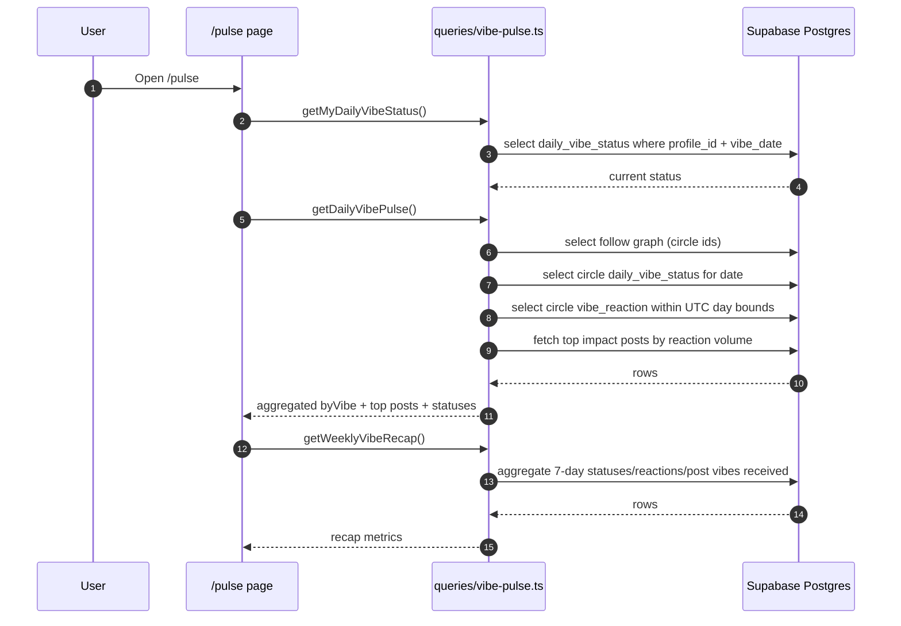

### Pulse Aggregation Formula

- Daily signal set = `daily_vibe_status` entries in circle + `vibe_reaction` entries in circle for the day.
- Per-vibe percent = `count(vibe) / totalSignals`.

### Pulse Presentation Layer (Current UI)

The Pulse card uses three visual layers to improve scanability and social energy:

1. **Vibe Mix Wheel**: conic-gradient radial composition of vibe percentages.
2. **Top Vibe Hero**: highlighted leading vibe state and share-of-signals.
3. **Vibe Skyline**: compact per-vibe vertical bars for side-by-side comparison.

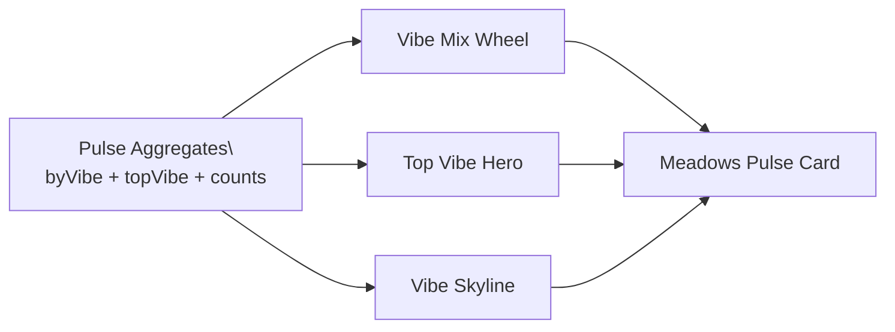

---

## 13. Feature Flow: Global Profile Search (Typeahead)

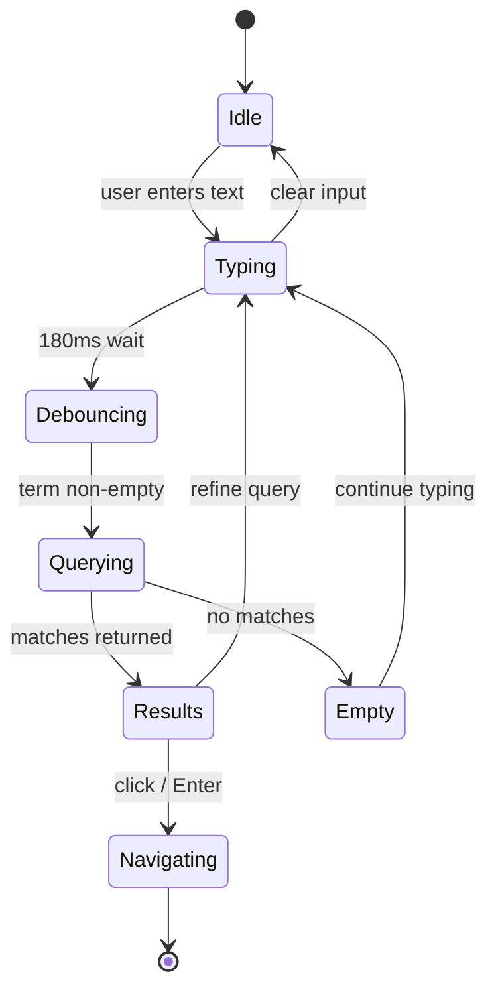

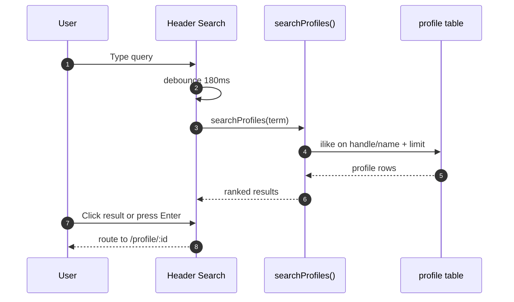

---

## 14. Notifications Architecture

### Event Sources

Current notification types are comment-centric:

- `post_comment`
- `comment_reply`
- `comment_mention`
- `comment_vibe`

### Delivery Pattern

1. Write notifications during mutation transaction flow in query layer.
2. Header polls notifications every 45 seconds (`queryKey: ['notifications', userId]`).
3. Opening notification menu triggers mark-as-read mutation.

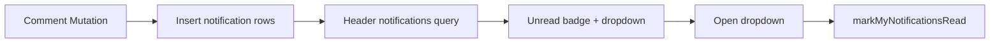

---

## 15. React Query Cache Topology

### Key Domains

- Identity/session: `user_profile`
- Feed: `posts`, `post`, `profile_posts`
- Profile graph: `profile`, `profile_followers`, `profile_following`
- Vibes: `daily_vibe_status`, `daily_vibe_pulse`, `weekly_vibe_recap`
- Comments: `post_comments`, `comment_mentions`
- Notifications: `notifications`
- Search: `profile_search`

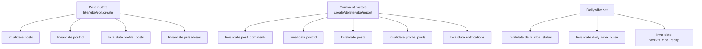

### Cache Design Notes

- Heavy fan-out invalidation is intentionally favored over complex local cache patching for correctness simplicity.
- Infinite lists use cursor offsets and `getNextPageParam` logic per page domain.

---

## 16. Security Model and Trust Boundaries

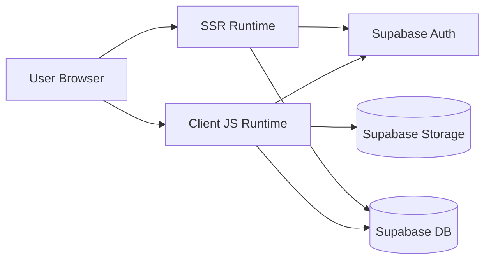

### Implemented Controls

1. Auth-gated SSR redirects for protected pages.
2. DB-level constraints and triggers enforcing:
   - reply depth,
   - comment rate limits,
   - counter integrity,
   - length checks.
3. Mutation-side normalization:
   - max comment length,
   - mention parsing,
   - note trimming.

### Important Gap to Address

- Repository SQL files do not currently include explicit RLS policy definitions (`ENABLE ROW LEVEL SECURITY` and `CREATE POLICY`).
- For production-grade security in Supabase, comprehensive RLS should be defined for all user-facing tables and buckets.

---

## 17. Performance Architecture

### Read Path Optimizations

1. Pagination by range/cursor for feeds and comment threads.
2. Denormalized counters (`post.comment_count`, `post_comment.reply_count`, `post_comment.vibe_count`) via triggers.
3. Sort-supporting indexes:
   - `post_comment_post_top_score_idx` for Top comments.
   - date/vibe indexes for daily pulse queries.
4. Batched pagination helper (`fetchPagedRows`) in vibe pulse queries for large circles.

### Write Path Optimizations

1. Optimistic updates on likes/vibes/poll votes.
2. Bulk notification insertion with dedupe map.
3. Mention lookup constrained by suggestion limit.

---

## 18. CI/CD and Delivery Pipeline

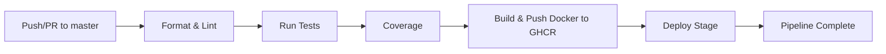

### Pipeline Stages (from `.github/workflows/ci.yml`)

1. Prettier + ESLint
2. Jest tests
3. Coverage artifact upload
4. Docker image build/push with Supabase env build args
5. Deploy placeholder stage

---

## 19. Detailed Feature Subsystems

### 19.1 Posting Subsystem

- Composer supports:
  - text post,
  - up to 8 image attachments,
  - optional poll (2-4 unique options).
- Poll vote model: one vote per user per post (`post_poll_vote` PK `(post_id, profile_id)`).

### 19.2 Conversation Subsystem

- Root comments fetched paged (`limit 10` default), sorted by top/newest.
- Replies loaded in bulk for visible roots and collapsed in UI beyond preview limit.
- Mentions:
  - typeahead suggestions from `profile.handle` prefix search,
  - mention entities persisted in `post_comment_mention`.

### 19.3 Vibe Intelligence Subsystem

- Vibe vocabulary (`aura_up`, `real`, `mood`, `chaotic`) centralized in `utils/vibe.ts`.
- Same vocabulary shared across:
  - post reactions,
  - comment reactions,
  - daily statuses,
  - pulse analytics and recap.

### 19.4 Discovery Subsystem (Profile Search)

- Global header search (authenticated routes) with:
  - debounced query,
  - keyboard navigation,
  - ranked result ordering,
  - direct profile routing.

### 19.5 Interaction & Responsive UX

- Feed post author affordances are intentionally explicit:
  - avatar is a direct profile link,
  - author block has strong hover/focus states and directional icon cue.
- Pulse \"Circle Vibe Statuses\" includes concise helper copy defining who counts as a friend and when statuses appear.
- Navbar was tuned for smaller screens with reduced control density and stable two-row flow.

---

## 20. Operational Recommendations (Next Architecture Iterations)

1. Add explicit RLS policies for all user-facing tables and storage buckets.
2. Introduce `updated_at` triggers consistently across all mutable tables.
3. Add DB migration versioning discipline (single source of truth between `database/` and `migrations/`).
4. Add observability instrumentation:
   - client error capture,
   - query latency metrics,
   - mutation failure dashboards.
5. Consider introducing a thin server-side BFF layer for sensitive workflows (optional).

---

## 21. Appendix: Query-to-Table Mapping

| Query Function Area | Main Tables Touched |
|---|---|
| Feed retrieval (`getFeed`, `getFollowingFeed`, `getLikesFeed`, `getMyPosts`) | `post`, `profile`, `like`, `vibe_reaction`, `post_attachment`, `post_poll`, `post_poll_option`, `post_poll_vote` |
| Post mutations (`createPost`, `toggleLike`, `setPostVibe`, `voteOnPostPoll`) | `post`, `post_attachment`, `post_poll*`, `like`, `vibe_reaction`, storage `images` |
| Profile ops (`getProfileData`, follow/followers/following, avatar) | `profile`, `follow`, storage `avatars` |
| Profile search (`searchProfiles`) | `profile` |
| Comments/replies (`createPostComment`, `getPostComments`, delete/report) | `post_comment`, `post_comment_report`, `post_comment_mention`, `post` |
| Comment vibes | `post_comment_vibe_reaction`, `post_comment` |
| Notifications (`getMyNotifications`, mark read) | `notification` |
| Daily pulse + recap | `daily_vibe_status`, `vibe_reaction`, `follow`, `post` |

---

## 22. Architecture Summary

Meadows is a Next.js + Supabase social platform with a deliberately thin application tier and rich domain logic encoded in query modules, SQL constraints, and triggers. The system’s strongest architectural traits are rapid product iteration, cohesive vibe-domain reuse, and efficient interaction loops. The highest-priority hardening area is formal RLS policy coverage across the full data surface.
