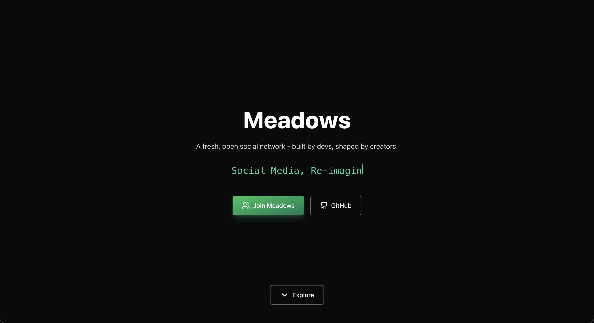
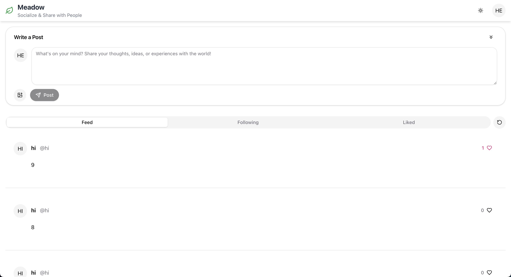
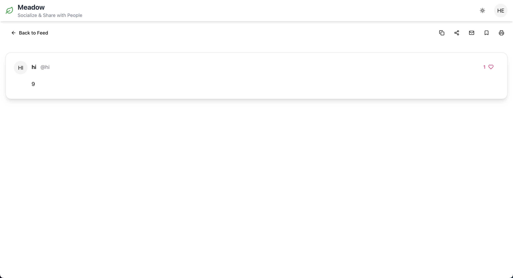
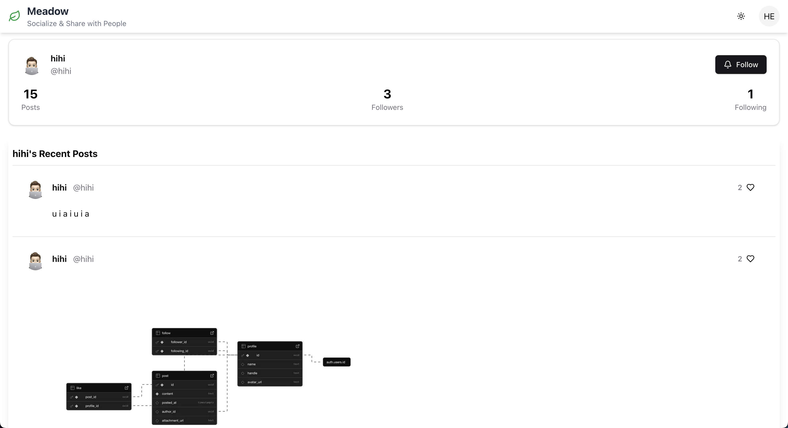
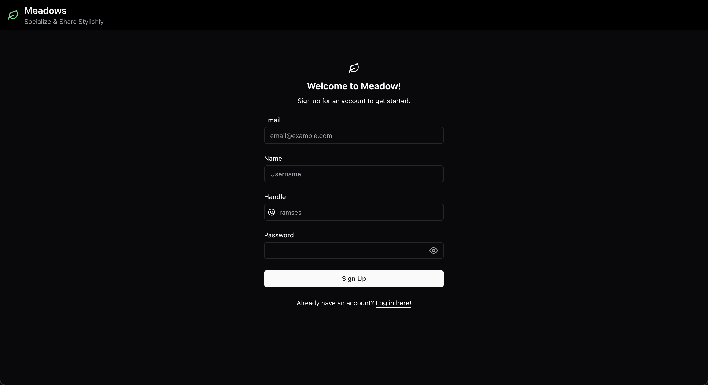
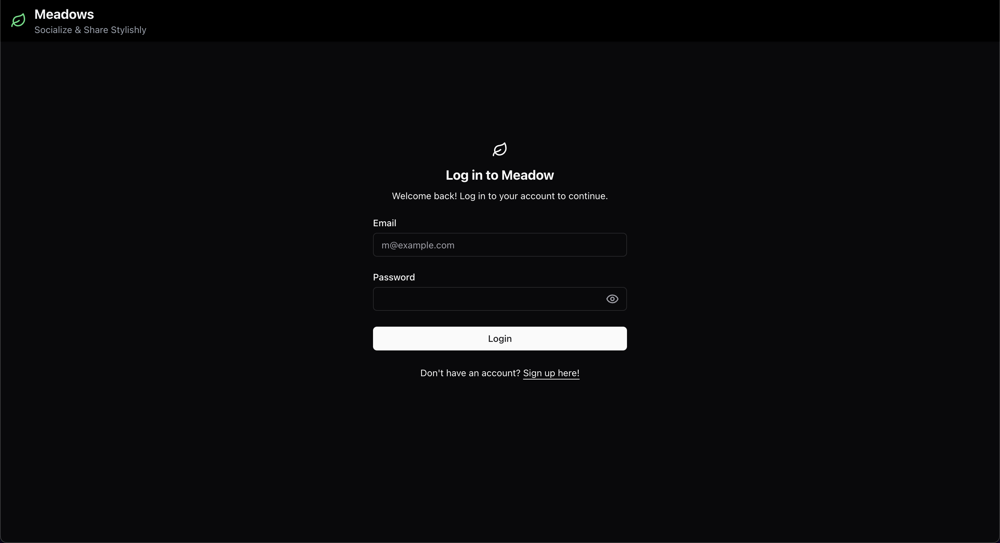
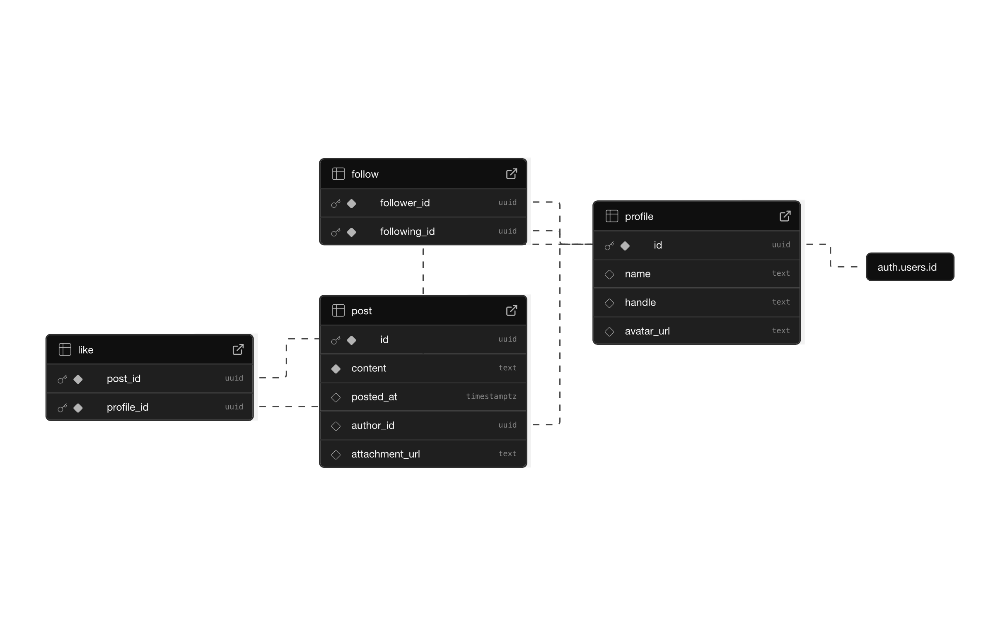

# Meadows - A Next.js Social Media for Gen-Z 🍃

A full-featured social feed application built with Next.js, Supabase, and React Query. Meadows lets users create posts (with optional images), follow other users, like posts, and manage their profiles. It includes infinite scrolling, light/dark mode, and a responsive, mobile-friendly design.

<p align="center">
  <a href="https://meadows.vercel.app/">
    
  </a>
</p>

<p align="center">
  
  
  
  
  
  
  
  
  
  
  
  
  
  
  
  
  
  
  
  
  
  
  
</p>

> [!IMPORTANT]
> **Live Web App**: **[https://meadows.vercel.app/](https://meadows.vercel.app/)** 🍃
>
> Please give it a try and start sharing your thoughts stylishly!

---

## Table of Contents

1. [Features](#features)
2. [Tech Stack](#tech-stack)
3. [Getting Started](#getting-started)
4. [Environment Variables](#environment-variables)
5. [Project Structure](#project-structure)
6. [Key Components](#key-components)
7. [Scripts](#scripts)
8. [Supabase Setup](#supabase)
9. [Testing & Formatting](#testing--formatting)
10. [GitHub Actions](#github-actions)
11. [Contributing](#contributing)
12. [License](#license)
13. [Acknowledgments](#acknowledgments)
14. [Contact](#contact)

---

## User Interface

<p align="center">
  
  
  
  
  
  
</p>

---

## Features

- **User Authentication** via Supabase
- **Profile Management**: upload/change avatar, view followers/following
- **Post Creation**: text + image uploads
- **Infinite Scrolling** for feeds and profiles
- **Like/Unlike** posts
- **Follow/Unfollow** other users
- **Light/Dark Mode** toggle
- **Share & Copy Link** buttons using Web Share API
- **Responsive Layout** spanning full width
- **Client-side Bookmarking** (via `localStorage`)
- **Server-Side Rendering** for initial data fetch
- **TypeScript** for type safety
- **Zod** for schema validation
- **ESLint & Prettier** for code quality
- and more!

---

## Tech Stack

- **Framework**: [Next.js](https://nextjs.org/)
- **Authentication & Database**: [Supabase](https://supabase.com/)
- **Data Fetching**: [React Query](https://tanstack.com/query/)
- **UI Components**: Custom, plus [lucide-react](https://lucide.dev/) icons
- **Styling**: Tailwind CSS (via shadcn/ui conventions)
- **File Storage**: Supabase Storage
- and more!

---

## Getting Started

1. **Clone the repo**

```bash
git clone https://github.com/hoangsonww/Meadows-Social-Media.git
cd Meadows-Social-Media/web
```

2. **Install dependencies**

```bash
npm install
# or
yarn
```

3. **Set up environment variables** (see next section)

4. **Run the dev server**

```bash
npm run dev
# or
yarn dev
```

Open [http://localhost:3000](http://localhost:3000) in your browser.

---

## Environment Variables

Create a `.env.local` file at project root with:

```ini
NEXT_PUBLIC_SUPABASE_URL=<your_supabase_url>
NEXT_PUBLIC_SUPABASE_ANON_KEY=<your_supabase_anon_key>
```

You can find these in your Supabase project settings.

---

## Project Structure

```
/
├── components/           # Reusable React components
│   ├── feed.tsx
│   ├── post.tsx
│   ├── ui/              # shadcn/ui-style components
│   └── ...
├── pages/                # Next.js pages
│   ├── index.tsx        # Home feed
│   ├── post/[id].tsx    # Single post view
│   ├── profile/[id].tsx # Public profile page
│   └── _app.tsx
├── utils/
│   ├── supabase/
│   │   ├── clients/     # Supabase client creators
│   │   └── queries/     # DB query functions
│   └── models/          # zod schemas
├── public/               # Static assets
├── styles/               # Global CSS (if any)
├── README.md
└── package.json
```

---

## Key Components

### `<Header />`

- Logo + subtitle
- Light/Dark mode toggle
- User dropdown: view profile, sign out

### `<HomePage />`

- “Write a Post” card with image upload
- Tabs: Feed / Following / Liked
- Inline infinite scroll of `<PostCard />`

### `<PostFeed />` (embedded directly)

- Renders `<PostCard />` components inline
- IntersectionObserver to fetch more

### `<PostPage />`

- Single post view
- Share, copy link, email, print, bookmark button

### `<PublicProfilePage />`

- Profile header: avatar, name, handle, follow button
- Stats: posts, followers, following
- Infinite scroll of user’s posts
- Modals for followers/following lists

---

## Scripts

- `dev`: Start development server
- `build`: Create a production build
- `start`: Run production build
- `lint`: Run ESLint
- `format`: Run Prettier

---

## Supabase Setup

This project uses Supabase for authentication and database management. Supabase provides a powerful backend-as-a-service solution that integrates seamlessly with Next.js applications.

To set up Supabase:

1. Create a new project on [Supabase](https://supabase.com/).
2. Set up authentication providers (email/password).
3. Create a `posts` table with the following schema:
   - `id`: UUID (Primary Key)
   - `user_id`: UUID (Foreign Key to users)
   - `content`: Text
   - `image_url`: Text (optional)
   - `created_at`: Timestamp
4. Create a `users` table with the following schema:
   - `id`: UUID (Primary Key)
   - `username`: Text (Unique)
   - `email`: Text (Unique)
   - `avatar_url`: Text (optional)
   - `created_at`: Timestamp
5. Do the same for the other tables like `followers`, `likes`, etc., as per the schema definitions in the [database directory](./database).
6. Set up Row Level Security (RLS) policies for the `posts` and `users` tables to allow authenticated users to read/write their own data.
7. Enable Supabase Storage for image uploads.
8. Enable Supabase Auth for user management.
9. Update the `.env.local` file with your Supabase URL and anon key.
10. Manage your database and tables using the Supabase dashboard as you develop your application.

FYI, you can find the schema definitions under the [database directory](./database). Below is a visual representation of the database schema:

<p align="center">
  
</p>

---

## Testing & Formatting

This project uses Jest for testing and Prettier for code formatting.

To run tests:

```bash
cd web

npm run test
# or
yarn test

# To run tests in watch mode
npm run test:watch
# or
yarn test:watch

# To run tests with coverage report
npm run test:coverage
# or
yarn test:coverage
```

To format code:

```bash
cd web

npm run format
# or
yarn format
```

Running `npm run format` will automatically format your code according to the Prettier configuration. It is recommended to run this command **every time** before committing changes to ensure consistent code style.

---

## GitHub Actions

This project uses GitHub Actions for continuous integration. The workflow is defined in `.github/workflows/ci.yml`. It runs the following checks on every push and pull request:

- Linting with ESLint
- Formatting with Prettier
- Running tests with Jest
- Building the Next.js application
- Checking for type errors with TypeScript
- Deploying to Vercel if all checks pass

The workflow ensures that all code changes meet the project's quality standards before being merged into the main branch.

---

## Contributing

1. Fork this repo
2. Create a feature branch (`git checkout -b feature/x`)
3. Commit your changes (`git commit -m "feat: your message"`)
4. Push to your branch (`git push origin feature/x`)
5. Open a pull request

Please ensure all new code is covered by tests and adheres to the project’s coding standards.

---

## License

This project is licensed under the MIT License. See the [LICENSE](./LICENSE) file for details.

Please note that while this project is open-source, it is intended for educational purposes and personal use. Please do not use it for commercial purposes without prior permission, and always give credit to the original authors regardless of usage.

---

## Acknowledgments

Big thanks to Prof. Ajay Gandecha at UNC-Chapel Hill for the inspiration and basic structure of this project. The original project was a simple social media app, and this version has been significantly expanded with additional features and improvements.

Additionally, thanks to the open-source community for the libraries and tools that made this project possible, including Next.js, Supabase, React Query, Tailwind CSS, and many others.

---

## Contact

If you have any questions or feedback, feel free to reach out to me via either:

- **Email**: [hoangson091104@gmail.com](mailto:hoangson091104@gmail.com)
- **GitHub**: [hoangsonww](https://github.com/hoangsonww)
- **LinkedIn**: [Son Nguyen](https://www.linkedin.com/in/hoangsonw/)

I welcome contributions, suggestions, and any issues you may encounter while using this project. Your feedback is invaluable in making Meadows better for everyone!

---

Thank you for checking out Meadows! I hope you find it useful and enjoyable to use. If you have any questions or suggestions, feel free to reach out or open an issue on GitHub. Happy coding! 🍃
